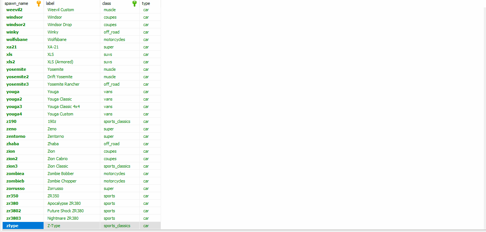

# Adding custom vehicles/classes

Adding new vehicles and classes is extremely easy

## Adding a vehicle

To add new vehicles, you'll have to create a new row for each vehicle you want to add in your database table `dealerships_creator_vehicles`

<figure><figcaption><p>Example with HeidiSQL</p></figcaption></figure>

An example of a query you can edit and use

```sql
INSERT IGNORE INTO `dealerships_creator_vehicles` 
(`spawn_name`, `label`, `class`, `type`) VALUES
('adder', 'Adder', 'super', 'car');
```

If you want to add your vehicle image, you can add it in `dealerships_creator/_vehicles_images` folder.

The image must be named `spawn_vehicle.webp` (Example adder.webp)


The vehicle's class must exist before you add the vehicle. If the vehicle has a custom class, create the class first


## Adding a vehicle class

To add new vehicles class, you'll have to create a new row for each class you want to add in your database table `dealerships_creator_classes`

An example of a query you can edit and use

```sql
INSERT IGNORE INTO `dealerships_creator_classes` 
(`id`, `label`) VALUES
('boats', 'Boats');

```
