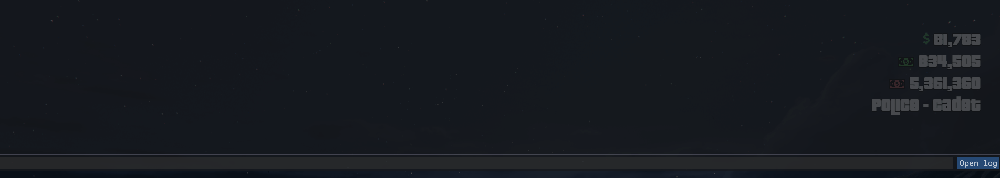
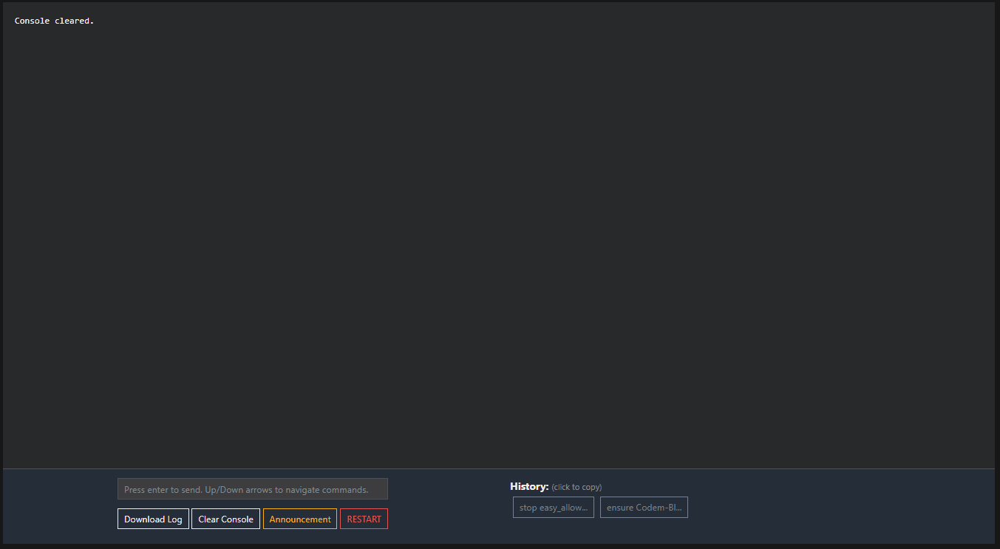
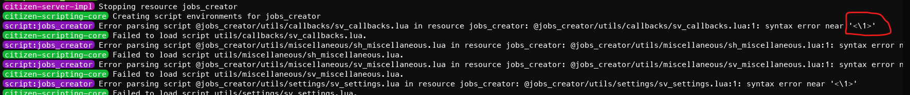
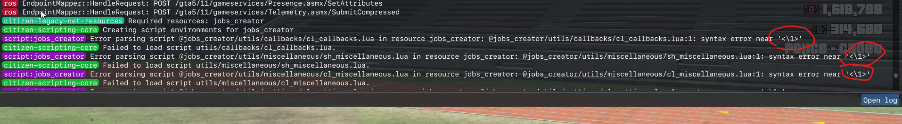
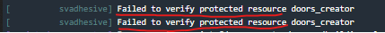
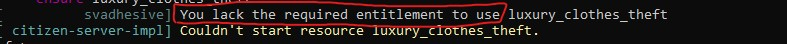

# Home


If the scripts work and as soon as you restart the server a few times they stop working, then you have a virus in your server. We can't help you in that case


Here you will find the solutions to common errors when using mine scripts due FiveM Escrow system

To verify if your error is caused by the FiveM asset escrow, you can simply restart the script and check **both** in **F8 console** and in **server console** (txAdmin) for errors

## <mark style="color:yellow;">How to know if my error is caused by FiveM escrow system?</mark>

To understand if something in a script is not working because of the FiveM asset escrow system, do this:&#x20;

1.  Restart the script causing issues, using the command `ensure your_script_name` in txAdmin console or restarting the script the way you usually do

    <figure><figcaption>
in-game F8 restart example
</figcaption></figure>

    <figure><figcaption>
server console restart example
</figcaption></figure>
2. Check the txAdmin console (server console) **and** the F8 in-game console, looking for errors
3. If there is any error similar to the ones in the [images below](home.md#examples-of-the-errors-caused-by-the-fivem-escrow-system), your issue **is caused by the FiveM asset escrow system**

### Examples of the errors caused by the FiveM Escrow system

<figure><figcaption>
<strong>Solution -></strong> <a href="error-parsing-script-...-less-than-1-greater-than.md"><strong>here</strong></a>
</figcaption></figure>

<figure><figcaption>
<strong>Solution -></strong> <a href="error-parsing-script-...-less-than-1-greater-than.md"><strong>here</strong></a>
</figcaption></figure>

<figure><figcaption>
<strong>Solution -></strong> <a href="failed-to-verify-protected-resource.md"><strong>here</strong></a>
</figcaption></figure>

<figure><figcaption>
<strong>Solution -></strong> <a href="you-lack-the-required-entitlement.md"><strong>here</strong></a>
</figcaption></figure>

## Solutions

If you can't start / use a script, here's a list of possible reasons/solutions:

* **Minimum** server artifacts version 4752
* OneSync has to be enabled
* **Don't** use FileZilla, use [WinSCP](https://winscp.net/eng/download.php) instead of it
* Use the correct license key generated by the same account where you downloaded the script

It's **strongly** suggested to read all the pages carefully, since these fixes are tested by many users and they are supposed to work, if none of the pages helps you to fix the errors, please read [here](what-to-do-if-nothing-is-fixing-the-errors.md)

\
\
\
You can find all mine scripts [here](https://jaksam1074-fivem-scripts.tebex.io/)
