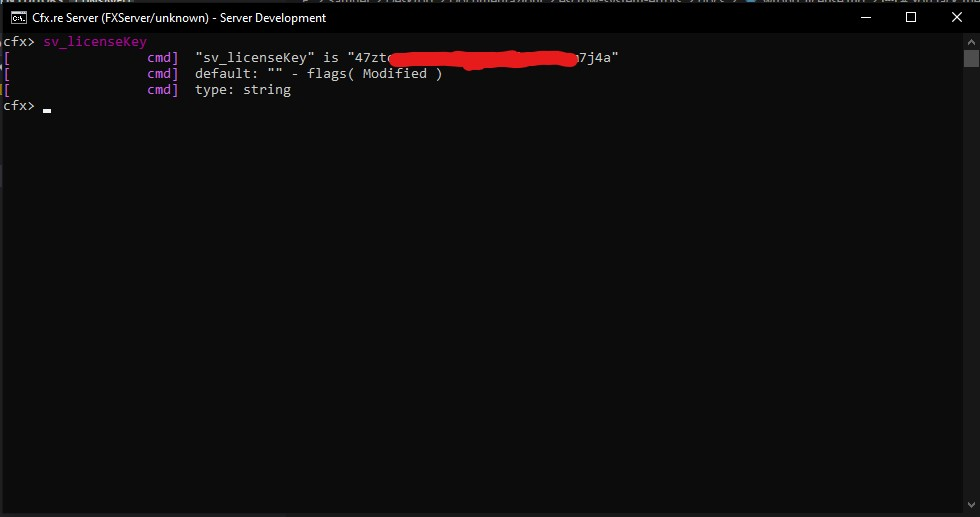

# You lack the required entitlement

Error message example:\
`You lack the required entitlement to use script_name`

## Reason

All scripts which are using the FiveM escrow system, are linked to your FiveM account (the account you used on Tebex).

In order to work, the script(s) require to run in a server which is using a server key created by the same FiveM account you used on Tebex.

## What is a server key?

* The server key is the key that can be generated in [FiveM keymaster](https://keymaster.fivem.net/)
* The server key it's **not** a script key
* A FiveM server can use only **1** server key

### Example of a server key in server.cfg

`sv_licenseKey "27ztq5g2pcjua67q4xywujkuzh5m7j4a"`

## How to verify my server key?

To verify what server key your server is currently using, you have to use the following command in your FiveM server console: `sv_licenseKey`

### Example:

<figure><figcaption></figcaption></figure>

## How to verify if I am using the correct server key?

To verify if you are using the correct **server key**, follow these steps:

1. Use the command `sv_licenseKey` in your FiveM server console
2. Take note of the **server key** you are currently using
3. Go to [FiveM keymaster](https://keymaster.fivem.net/)
4.  Verify if in the account which you are logged in [FiveM keymaster](https://keymaster.fivem.net/) owns the script(s) you are trying to use. If the script is not there, it means you used a different account on Tebex, or you have transferred the script to another account\
    **Example with** [**Jobs Creator script**](https://forum.cfx.re/t/jobs-creator-4-6-esx-in-game-job-creation-menu-without-server-restart/2667762)&#x20;

    <figure><figcaption></figcaption></figure>
5.  If the account you are using in [FiveM keymaster](https://keymaster.fivem.net/) owns the script(s), you have to verify if the **server key** your server is using, it's generated by the same account

    <figure><figcaption></figcaption></figure>

## My server key is generated by someone else that's not me, what can I do?

You have 2 options:

* Generate a key from your account and to use it
* Transfer the script ownership to the other account

## How to transfer the script to another account?

To transfer the script to another account, you can head to:

[FiveM keymaster](https://keymaster.fivem.net/) -> **Purchased assets** tab -> **Transfer to another account** red button

**Note: cfx.re decided that the scripts can be transferred only 1 time, so you won't be able to transfer the script again**

## ZAP-Hosting server key

If you are using a Zap-Hosting server, you do **not** have to enter your server key in server.cfg, but directly in their website

[Here there is the official guide of ZAP hosting for it](https://zap-hosting.com/guides/docs/en/fivem\_licensekey/)

Example screenshot:&#x20;

<figure><figcaption></figcaption></figure>
