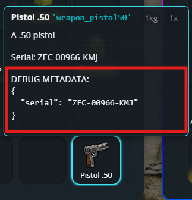

# How to open admin inventory (omnipack)
If you already have admin permissions (you can see it by typing `/inventory` in-game), you can open the omnipack by simply opening your inventory (F2), and then pressing F1.

Moving an item **TO** omnipack, will **delete** it

<figure><figcaption></figcaption></figure>

# How to show metadata to players
Showing specific metadata to players is easy. First of all, you'll need to know what is the metadata key you want to show, to do so, you can enable "Debug mode" in the `/inventory` settings menu, then hover the item you want to see the metadata of

<table>
<tr>
<td></td>
<td></td>
</tr>
</table>

## Adding it to a single item
To show to players the metadata of a single item, you can add and adapt this code in the single item definition, in `jaksam_inventory/_data/items.lua` file:

```lua
displayFields = {
    { field = 'YOUR_METADATA_KEY_HERE', label = 'TEXT YOU WANT HERE: ${value}'}, -- Random example
    { field = 'ammo', label = 'Ammo: ${value}'}, -- Useful on weapons (already built in by default)
    { field = 'plate', label = 'Plate: ${value}'}, -- Useful on carkeys
},

```
## Adding it to all item type
To show to players the metadata of an entire item type, it's 100% the same method, but place it in the `Script.defaultsByType` table, in `jaksam_inventory/_data/defaults.lua` file

## Optional: Making metadata values look nicer
Sometimes you want to show metadata in a prettier way to players. For example, instead of showing "weapon_pistol", you want to show "Pistol". This is where formatters come in!

A formatter is like a translator:
- It takes the original value (e.g. "weapon_pistol") 
- Converts it to something nicer (e.g. "Pistol")

You can use built-in formatters or create your own custom ones in `jaksam_inventory/_data/formatter.lua`. Here's how to use them:

```lua
displayFields = {
    { field = 'item', label = 'Label: ${value}', formatterId = "itemNameToLabel"}, -- An example with built in formatter
},
```
# How to set default metadata for items
Want items to have certain metadata values when they're first created? For example, maybe you want new weapons to start with 50% durability. Here's how to do it:

1. Type `/inventory` in-game to open the admin menu
2. Find and click on the item you want to edit
3. Click on the "metadata" tab
4. Set the metadata values you want

## Advanced - Using templates for dynamic metadata
Sometimes you want metadata that changes based on certain conditions. For this, you can use templates:

1. Go to the same metadata tab in the item editor
2. Change the metadata type to `template` 
3. Either:
   - Select an existing template, or
   - Create your own template in `jaksam_inventory/_data/metadata_templates.lua`

Templates let you create metadata that updates automatically based on rules you define!

### Example
Some examples of what you can do with dynamic metadata templates:
- Assign to a player Identification Card, his name, birth date, height, etc.
- Assign a random durability to a weapon
- Assign the creation date to an item (the first time the item is created)

# Adding custom weapon attachments/components

In GTA V, each weapon has different component IDs for the same attachment type. For example, a suppressor for a Pistol uses `COMPONENT_AT_PI_SUPP`, while a Combat Pistol uses `COMPONENT_AT_PI_SUPP_02`

**The inventory system simplifies this:** You can create ONE item (like "suppressor") that automatically works with all compatible weapons by mapping multiple component IDs to it

## Step-by-step guide

### Step 1: Check if the item exists

First, check if an item for your attachment type already exists. For example, if you want to add a modded suppressor:
- Look in your inventory or use `/inventory` to see if a "suppressor" item already exists
- If it exists, note down its **item ID** (not the label)

### Step 2A: If the item already exists

Simply open `jaksam_inventory/_data/components.lua` and add your modded component ID to the existing item:

```lua
["suppressor"] = {
    "COMPONENT_AT_PI_SUPP",
    "COMPONENT_AT_PI_SUPP_02",
    "YOUR_MODDED_COMPONENT_ID_HERE",  -- Add your new component ID here, don't forget to add a comma after each ID
},
```

### Step 2B: If the item doesn't exist

1. Type `/inventory` in-game to open the admin menu
2. Create a new item with these settings:
   - **Item ID**: Choose a clear name (e.g., `red_dot_sight`)
   - **Item Type**: **IMPORTANT!** Select the correct type:
     - `attachment_scope` - For scopes and sights
     - `attachment_barrel` - For suppressors, muzzle brakes, compensators
     - `attachment_grip` - For grips and foregrips
     - `attachment_flashlight` - For flashlights and tactical lights
     - `attachment_magazine` - For extended magazines
     - etc
   - **Other settings**: Set weight, label, description, and image as you prefer

3. Note down the **item ID** you created

4. Open `jaksam_inventory/_data/components.lua` and add your mapping:

```lua
["your_item_id_here"] = {
    "YOUR_COMPONENT_ID_1",
    "YOUR_COMPONENT_ID_2",
    -- Add all component IDs this item should cover
},
```

## Example

Let's say you have a modded weapon with a custom scope component `COMPONENT_MODDED_SCOPE_01`:

**Option A - Item exists:**
```lua
["scope"] = {
    "COMPONENT_AT_SCOPE_MACRO",
    "COMPONENT_AT_SCOPE_SMALL",
    "COMPONENT_MODDED_SCOPE_01",  -- Added
},
```

**Option B - Create new item `custom_scope` via `/inventory`, then:**
```lua
["custom_scope"] = {
    "COMPONENT_MODDED_SCOPE_01",
    "COMPONENT_MODDED_SCOPE_02",
},
```

**That's it!** The system will automatically apply the correct component based on the weapon