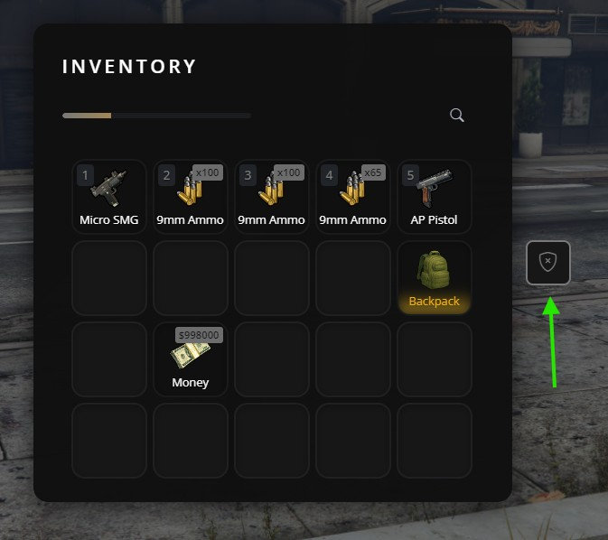
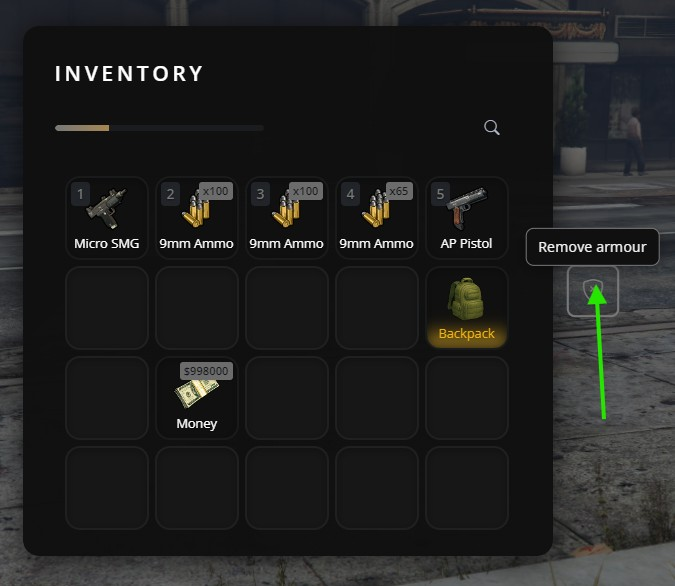

# Action Buttons

Action buttons are custom buttons that appear in the inventory UI toolbar. Unlike [Context Actions](context-actions.md) (which appear when right-clicking an item), action buttons are always visible in the inventory header and can trigger any custom logic.

<table>
<tr>
<td></td>
<td></td>
</tr>
</table>

## When to use Action Buttons

Use action buttons when you need:
- A button always visible in the inventory (not item-specific)
- Quick access to features like "Police Menu", "Garage", "Crafting", etc.
- Job-specific or role-specific actions

## Basic Usage

### Registering a button

```lua
exports['jaksam_inventory']:registerActionButton(
    'my_button',           -- Unique ID
    'bi-star-fill',        -- Bootstrap Icons class
    'My Tooltip',          -- Tooltip on hover (or nil)
    function()             -- Click callback
        print('Clicked!')
    end,
    true                   -- Visible (default: true)
)
```

### Removing a button

```lua
exports['jaksam_inventory']:unregisterActionButton('my_button')
```

### Showing/Hiding without removing

```lua
-- Hide (button stays registered, just invisible)
exports['jaksam_inventory']:hideActionButton('my_button')

-- Show again
exports['jaksam_inventory']:showActionButton('my_button')
```

## Practical Examples

### Job-specific button (Police)

Register the button once when the resource starts, then show/hide based on job:

```lua
-- Register on resource start (hidden by default)
CreateThread(function()
    exports['jaksam_inventory']:registerActionButton(
        'police_menu',
        'bi-shield-check',
        'Police Actions',
        function()
            TriggerEvent('police:openActionsMenu')
        end,
        false -- Start hidden
    )
end)

-- Show/hide based on job changes
AddEventHandler('esx:setJob', function(job)
    if job.name == 'police' then
        exports['jaksam_inventory']:showActionButton('police_menu')
    else
        exports['jaksam_inventory']:hideActionButton('police_menu')
    end
end)

-- Also check on player load
RegisterNetEvent('esx:playerLoaded', function(xPlayer)
    if xPlayer.job.name == 'police' then
        exports['jaksam_inventory']:showActionButton('police_menu')
    end
end)
```

### Button that opens a stash

```lua
exports['jaksam_inventory']:registerActionButton(
    'open_personal_stash',
    'bi-box-seam',
    'Personal Stash',
    function()
        exports['jaksam_inventory']:openInventory('personal_stash_' .. GetPlayerServerId(PlayerId()))
    end
)
```

### Crafting menu button

```lua
exports['jaksam_inventory']:registerActionButton(
    'crafting_menu',
    'bi-hammer',
    'Crafting',
    function()
        TriggerEvent('crafting:openMenu')
    end
)
```

### Multiple buttons for different jobs

```lua
local jobButtons = {
    police = { id = 'btn_police', icon = 'bi-shield-check', tooltip = 'Police Menu', event = 'police:menu' },
    ambulance = { id = 'btn_ambulance', icon = 'bi-heart-pulse', tooltip = 'EMS Menu', event = 'ambulance:menu' },
    mechanic = { id = 'btn_mechanic', icon = 'bi-tools', tooltip = 'Mechanic Tools', event = 'mechanic:menu' },
}

-- Register all buttons as hidden
CreateThread(function()
    for _, btn in pairs(jobButtons) do
        exports['jaksam_inventory']:registerActionButton(
            btn.id,
            btn.icon,
            btn.tooltip,
            function()
                TriggerEvent(btn.event)
            end,
            false
        )
    end
end)

-- Show correct button based on job
AddEventHandler('esx:setJob', function(job)
    -- Hide all job buttons
    for _, btn in pairs(jobButtons) do
        exports['jaksam_inventory']:hideActionButton(btn.id)
    end
    
    -- Show the one for current job (if exists)
    if jobButtons[job.name] then
        exports['jaksam_inventory']:showActionButton(jobButtons[job.name].id)
    end
end)
```

## Important Notes
1. **Unique IDs**: Each button must have a unique ID. Registering with the same ID will overwrite the previous button
2. **Persistence**: Buttons survive inventory open/close but are lost on resource restart. Re-register them when your resource starts
3. **Performance**: Don't register/unregister buttons repeatedly. Register once, then use show/hide to toggle visibility

