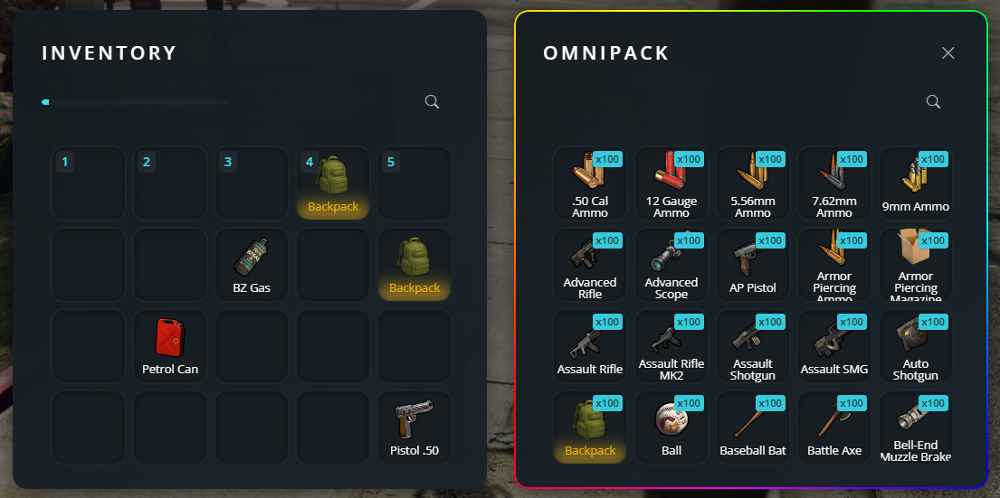

# How to open admin inventory (omnipack)
If you already have admin permissions (you can see it by typing `/inventory` in-game), you can open the omnipack by simply opening your inventory (F2), and then pressing F1.

Moving an item **TO** omnipack, will **delete** it

<figure><figcaption></figcaption></figure>

