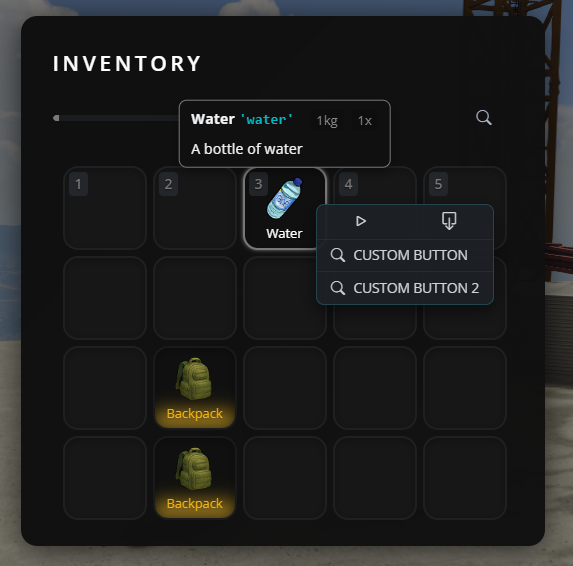
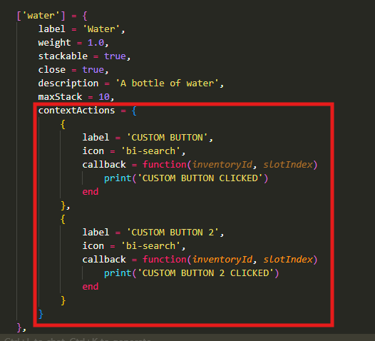

# How to add custom buttons (Context Actions) to items

Context Actions are custom buttons that appear when you right-click an item in your inventory. They allow players to perform specific actions on items, like using, inspecting, or any custom behavior you want

<table>
<tr>
<td></td>
<td></td>
</tr>
</table>

## When to use each method:
- **Single item**: Use when you want buttons for ONE specific item (e.g., only on "water" item)
- **By type**: Use when you want the same buttons on ALL items of the same type (e.g., all weapons, all containers)

## Method 1: Adding buttons to a single item

To add custom buttons to a single specific item, open `jaksam_inventory/_data/items.lua` and find or create your item. Add the `contextActions` property:

```lua
['water'] = {
    label = 'Water',
    weight = 1.0,
    stackable = true,
    close = true,
    description = 'A bottle of water',
    maxStack = 10,
    contextActions = {
        {
            label = 'Drink',                    -- Button text that players see
            icon = 'bi-droplet',                -- Icon (Bootstrap Icons)
            callback = function(inventoryId, slotIndex)
                -- Your code here - this runs when the button is clicked
                TriggerServerEvent('myserver:drinkWater', inventoryId, slotIndex)
            end
        },
        {
            label = 'Check expiration',
            icon = 'bi-calendar-check',
            callback = function(inventoryId, slotIndex)
                print('Checking expiration date...')
                -- Add your logic here
            end
        }
    }
},
```

**Important notes:**
- `inventoryId`: Identifies which inventory the item is in (player inventory, vehicle trunk, etc.)
- `slotIndex`: The slot number where the item is located
- `icon`: Use Bootstrap Icons (search "bootstrap icons" online to find icon names)

## Method 2: Adding buttons to all items of a specific type

If you want the same buttons to appear on ALL items of the same type (like all weapons, all food items, etc.), use the defaults system.

Open `jaksam_inventory/_data/defaults.lua` and add or modify the type you want:

```lua
Script.defaultsByType = {
    ['weapon'] = {
        displayFields = {
            -- ... existing display fields ...
        },
        contextActions = {
            {
                label = 'Empty ammo',
                icon = 'bi-asterisk',
                callback = function(inventoryId, slotIndex)
                    TriggerServerEvent(Utils.eventsPrefix .. ":emptyAmmo", inventoryId, slotIndex)
                end
            },
            {
                label = 'View components',
                icon = 'bi-eye',
                callback = function(inventoryId, slotIndex)
                    Script.closeInventoryUI()
                    Script.viewComponents(inventoryId, slotIndex)
                end
            }
        }
    },
    
    ['food'] = {
        contextActions = {
            {
                label = 'Eat',
                icon = 'bi-egg-fried',
                callback = function(inventoryId, slotIndex)
                    TriggerServerEvent('myserver:eatFood', inventoryId, slotIndex)
                end
            }
        }
    },
}
```

**This means:**
- ALL items with `type = 'weapon'` will have "Empty ammo" and "View components" buttons
- ALL items with `type = 'food'` will have an "Eat" button

## Adding global buttons to ALL items

You can also add buttons that appear on EVERY item in the game using the special `['*']` key:

```lua
Script.defaultsByType = {
    ['*'] = {
        contextActions = {
            {
                label = 'Inspect',
                icon = 'bi-search',
                callback = function(inventoryId, slotIndex)
                    print('Inspecting item...')
                    -- Your code here
                end
            }
        }
    },
}
```

