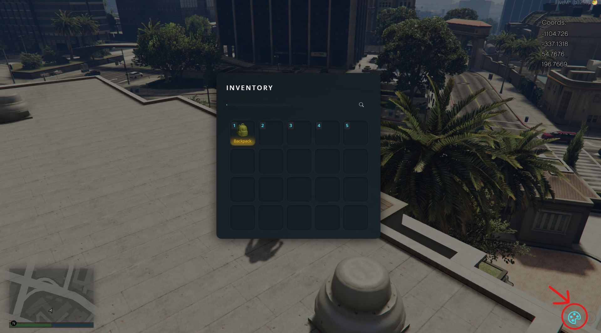
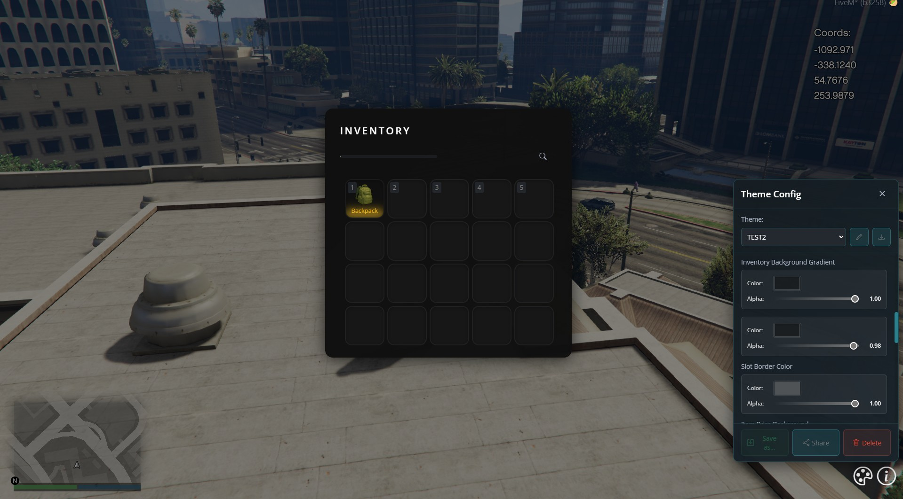
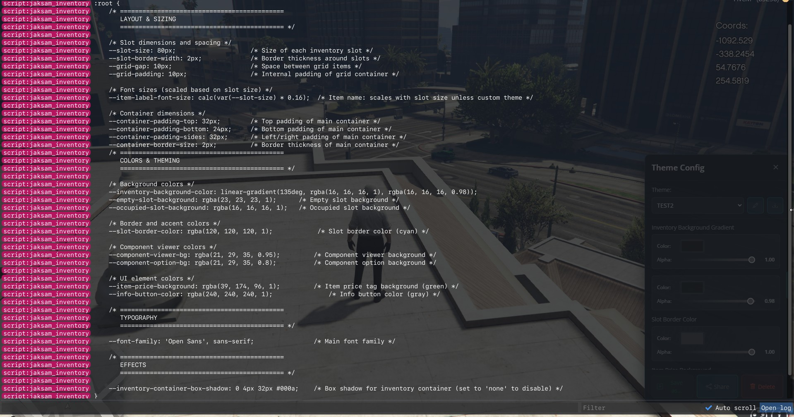

# How to set a custom default theme for everyone

> **Want every player to have the same default theme? Here's how to do it, step-by-step**

1. Open your inventory in-game by pressing **F2**
2. Click the **Theme** button (bottom right corner)

<figure><figcaption></figcaption></figure>


3. Change the colors and styles as you like, then hit **Save**
4. Make sure your custom theme is selected

<figure><figcaption></figcaption></figure>

5. Press **F8** to open the console, then type:
   ```
   admintheme
   ```
6. You'll see a bunch of code. Copy *everything* between  
   `COPY FROM THE LINE BELOW`  
   **and**  
   `COPY TILL THE LINE ABOVE`

<figure><figcaption></figcaption></figure>

7. Go to the server files and open:  
   `jaksam_inventory/dist/assets/variables.css`
8. Paste what you copied, replacing everything in that file
9. Restart the script/reload the server

That's it! Now, everyone's default theme will use your custom colors and settings (unless they change it themselves)