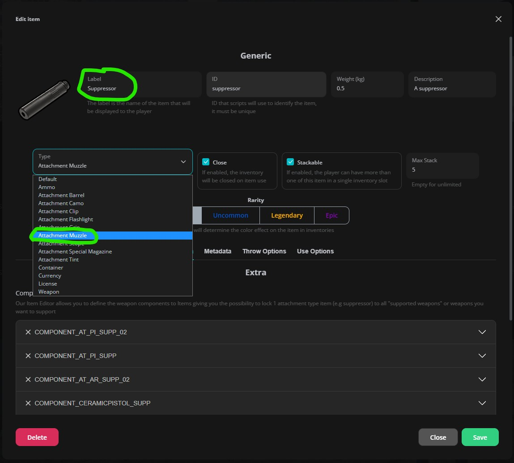
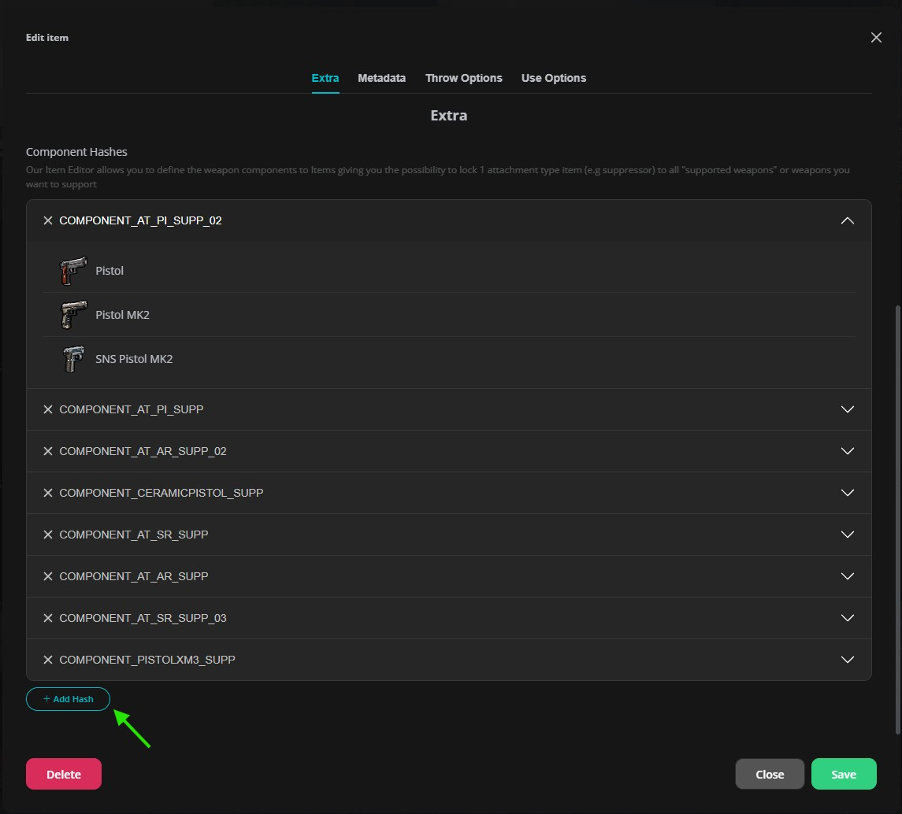

# Adding custom weapon attachments/components

In GTA V, each weapon has different component IDs for the same attachment type. For example, a suppressor for a Pistol uses `COMPONENT_AT_PI_SUPP`, while a Combat Pistol uses `COMPONENT_AT_PI_SUPP_02`

**The inventory system simplifies this:** You can create ONE item (like "suppressor") that automatically works with all compatible weapons by mapping multiple component IDs to it

## Step-by-step guide

### Step 1: Check if the item exists

First, check if an item for your attachment type already exists. For example, if you want to add a modded suppressor:
- Look in your inventory or use `/inventory` to see if a "suppressor" item already exists, otherwise create it. Make sure to set the correct item type (barrel, clip, scope, etc.)

Example with default suppressor

### Step 2
Add component hashes to the item, usually there are multiple components that you can add to the item


The menu will show you what weapon are compatible with the component hash


**That's it!** The system will automatically apply the correct component based on the weapon

