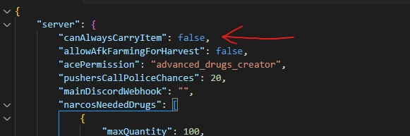
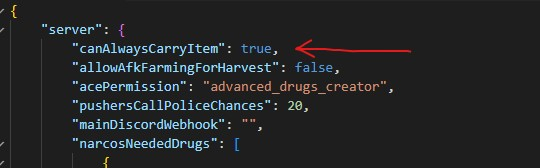
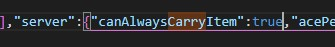
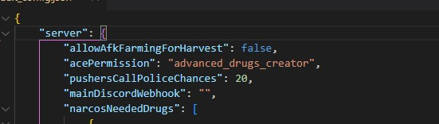
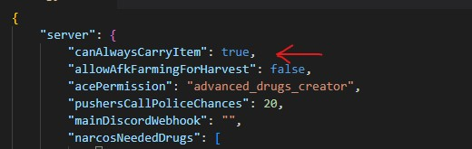

# Issues with items

It may happen that if you have particular inventories, item addition or removal causes errors in server console

In this case, to try fixing the issue try doing the following steps:

## Step 1

1. Go in the script folder in `integrations/sv_integrations.lua` file
2. Set this option from

```lua
SKIP_ITEM_EXISTS_CHECK = false
```

to

```lua
SKIP_ITEM_EXISTS_CHECK = true
```

## Step 2

1. If the script has a `default_config.json` file, edit this option in the `"server"` section from

```json
"canAlwaysCarryItem": false,
```

to

```json
"canAlwaysCarryItem": true,
```

Example screenshots:

Before:

<figure><figcaption></figcaption></figure>

After:

<figure><figcaption></figcaption></figure>

2\. If the script has `current_config.json` file (which is a different file from the previous one), edit again the option `canAlwaysCarryItem` to true

Example screenshots:

Before:

<figure><figcaption></figcaption></figure>

After:

<figure><figcaption></figcaption></figure>

### What to do if I don't have canAlwaysCarryItem option?

If you don't have the `canAlwaysCarryItem` option, you simply need to add it, be sure to add it at the **beginning** of the `server` part

Example

Before:

<figure><figcaption></figcaption></figure>

After:

<figure><figcaption></figcaption></figure>

## Step 3

The item you are working on, must exist to be used in the scripts. To be sure the item exist, you can try to give it to yourself

Creating the item depends on your framework and/or on your inventory, so creating it will be up to you
