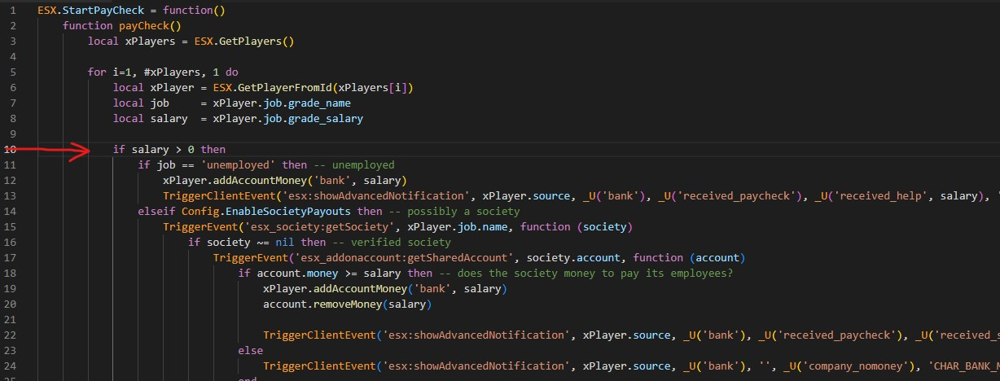
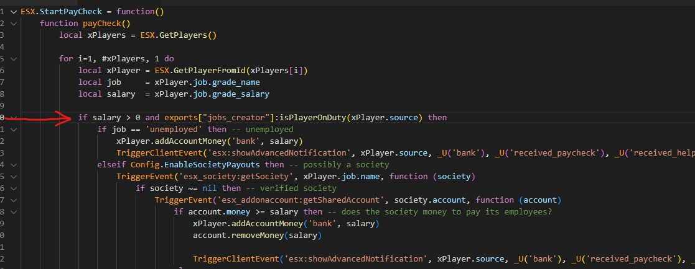

# How to disable salary when player is off-duty

The reason why after you go off-duty, you still receive salary, it's because es\_extended handles the players salary

To disable players salary when they are off-duty, you have to integrate Jobs Creator event with es\_extended.

To do it, you have to edit the code in `es_extended/server/paycheck.lua` and to replace with the snippet below:

## New code (should replace all the old code of paycheck.lua)

```lua
ESX.StartPayCheck = function()
	function payCheck()
		local xPlayers = ESX.GetPlayers()

		for i=1, #xPlayers, 1 do
			local xPlayer = ESX.GetPlayerFromId(xPlayers[i])
			local job     = xPlayer.job.grade_name
			local salary  = xPlayer.job.grade_salary

			if salary > 0 and exports["jobs_creator"]:isPlayerOnDuty(xPlayer.source) then
				if job == 'unemployed' then -- unemployed
					xPlayer.addAccountMoney('bank', salary)
					TriggerClientEvent('esx:showAdvancedNotification', xPlayer.source, _U('bank'), _U('received_paycheck'), _U('received_help', salary), 'CHAR_BANK_MAZE', 9)
				elseif Config.EnableSocietyPayouts then -- possibly a society
					TriggerEvent('esx_society:getSociety', xPlayer.job.name, function (society)
						if society ~= nil then -- verified society
							TriggerEvent('esx_addonaccount:getSharedAccount', society.account, function (account)
								if account.money >= salary then -- does the society money to pay its employees?
									xPlayer.addAccountMoney('bank', salary)
									account.removeMoney(salary)

									TriggerClientEvent('esx:showAdvancedNotification', xPlayer.source, _U('bank'), _U('received_paycheck'), _U('received_salary', salary), 'CHAR_BANK_MAZE', 9)
								else
									TriggerClientEvent('esx:showAdvancedNotification', xPlayer.source, _U('bank'), '', _U('company_nomoney'), 'CHAR_BANK_MAZE', 1)
								end
							end)
						else -- not a society
							xPlayer.addAccountMoney('bank', salary)
							TriggerClientEvent('esx:showAdvancedNotification', xPlayer.source, _U('bank'), _U('received_paycheck'), _U('received_salary', salary), 'CHAR_BANK_MAZE', 9)
						end
					end)
				else -- generic job
					xPlayer.addAccountMoney('bank', salary)
					TriggerClientEvent('esx:showAdvancedNotification', xPlayer.source, _U('bank'), _U('received_paycheck'), _U('received_salary', salary), 'CHAR_BANK_MAZE', 9)
				end
			end

		end

		SetTimeout(Config.PaycheckInterval, payCheck)
	end

	SetTimeout(Config.PaycheckInterval, payCheck)
end
```

## I have an error / the code doesn't work

The snippet doesn't work on all ESX version, this won't be an issue because the only code you need to add, it's

```lua
and exports["jobs_creator"]:isPlayerOnDuty(xPlayer.source)
```

An example:

**Before**&#x20;

<figure><figcaption></figcaption></figure>

**After**&#x20;

<figure><figcaption></figcaption></figure>
