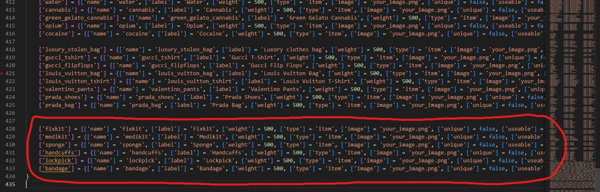

# Installation

## Installation

The installation of the script is extremely easy



## Installation

1. Download the script and extract it in your resources
2. Add the script in your auto start (example: server.cfg)
3. The script will **automatically** setup the database, in case it doesn't, you can manually run the files in `jobs_creator/sql/` folder

## Adding the items - Optional

To add the premade items, you only have to run the file `jobs_creator/sql/items_limit.sql` **or** `jobs_creator/sql/items_weight.sql` depending on your server, if it uses the limit or the weight


The latest version of ESX uses **weight**



If it doesn't work, be sure to use the latest version of the official ESX with the dependencies




## Installation

1. Download the script and extract it in your resources
2. Add the script in your auto start (example: server.cfg)
3. The script will **automatically** setup the database, in case it doesn't, you can manually run the files in `jobs_creator/sql/` folder
4. Download and extract [the script menu\_default (clickable link)](https://cdn.discordapp.com/attachments/895599870268817418/987388095169179688/menu\_default.rar) in your resources, **without renaming it**, and add it to auto start (example: server.cfg)

## Adding the items - Optional

To add the new items, you have to edit `qb-core/shared/items.lua` file and add at the bottom of the table the following code

```lua
	['fixkit'] = {['name'] = 'fixkit', ['label'] = 'Fixkit', ['weight'] = 500, ['type'] = 'item', ['image'] = 'your_image.png', ['unique'] = false, ['useable'] = false, ['shouldClose'] = false, ['combinable'] = nil},
	['medikit'] = {['name'] = 'medikit', ['label'] = 'Medikit', ['weight'] = 500, ['type'] = 'item', ['image'] = 'your_image.png', ['unique'] = false, ['useable'] = false, ['shouldClose'] = false, ['combinable'] = nil},
	['sponge'] = {['name'] = 'sponge', ['label'] = 'Sponge', ['weight'] = 500, ['type'] = 'item', ['image'] = 'your_image.png', ['unique'] = false, ['useable'] = false, ['shouldClose'] = false, ['combinable'] = nil},
	['handcuffs'] = {['name'] = 'handcuffs', ['label'] = 'Handcuffs', ['weight'] = 500, ['type'] = 'item', ['image'] = 'your_image.png', ['unique'] = false, ['useable'] = false, ['shouldClose'] = false, ['combinable'] = nil},
	['lockpick'] = {['name'] = 'lockpick', ['label'] = 'Lockpick', ['weight'] = 500, ['type'] = 'item', ['image'] = 'your_image.png', ['unique'] = false, ['useable'] = false, ['shouldClose'] = false, ['combinable'] = nil},
	['bandage'] = {['name'] = 'bandage', ['label'] = 'Bandage', ['weight'] = 500, ['type'] = 'item', ['image'] = 'your_image.png', ['unique'] = false, ['useable'] = false, ['shouldClose'] = false, ['combinable'] = nil},
```

#### Screenshot example

<figure><figcaption></figcaption></figure>


If it doesn't work, be sure to use the latest version of the official QBCore with the dependencies




You are ready to go! Enjoy the script 😁

## Optional step

After the database is setup correctly, you can delete the files in `jobs_creator/sql/` folder, so the script won't try to setup the database each time you start the script
