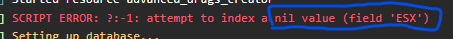
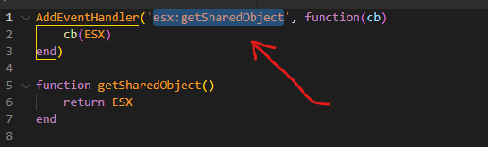
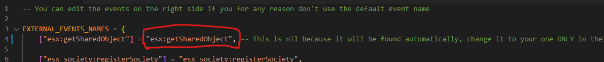

# Manually set ESX shared object

On ESX, it may happen for many reason that you encounter the following error error (in F8 console or in server console)

<figure><figcaption></figcaption></figure>

This usually happens because the script cannot find the _ESX shared object_ of your `es_extended` script automatically

To solve the issue, you have to find the shared object name of your `es_extended` script in the file `es_extended/client/common.lua`

This is an example of what you can find (you may have something else)&#x20;

<figure><figcaption></figcaption></figure>

After you found your _ESX shared object_ name, you can manually set it in the files `integrations/sv_integrations.lua` **and** `integrations/cl_integrations.lua`, replacing the `nil` with the name of your shared object **(between double quotes)**

**Do not** replace the left side, only replace the right side

An example:&#x20;

<figure><figcaption></figcaption></figure>
