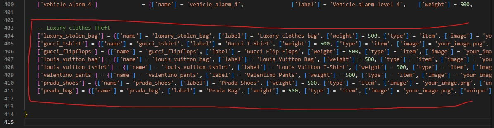

# Installation

The installation of the script is extremely easy

## Steps

1. Download the script and extract it in your resources
2. Add the script in your auto start (example: server.cfg)
3. Configure the options in the config files (be sure to read the comments, they'll explain you everything)
4. (QBCore only) Download and extract [this script](https://cdn.discordapp.com/attachments/895599870268817418/987388095169179688/menu\_default.rar) in your resources, **without renaming it**

You are ready to go! Enjoy the script 😁

## Adding items

### ESX

To add the premade items/drugs, you only have to run the file `luxury_clothes_theft/sql/items_limit.sql` **or** `luxury_clothes_theft/sql/items_weight.sql` depending on your server, if it uses the limit or the weight

### QBCore

To add the new items, you have to edit `qb-core/shared/items.lua` file and add at the bottom of the table the following code

```lua
    ['luxury_stolen_bag'] = {['name'] = 'luxury_stolen_bag', ['label'] = 'Luxory clothes bag', ['weight'] = 500, ['type'] = 'item', ['image'] = 'your_image.png', ['unique'] = false, ['useable'] = false, ['shouldClose'] = false, ['combinable'] = nil},
	['gucci_tshirt'] = {['name'] = 'gucci_tshirt', ['label'] = 'Gucci T-Shirt', ['weight'] = 500, ['type'] = 'item', ['image'] = 'your_image.png', ['unique'] = false, ['useable'] = false, ['shouldClose'] = false, ['combinable'] = nil},
	['gucci_flipflops'] = {['name'] = 'gucci_flipflops', ['label'] = 'Gucci Flip Flops', ['weight'] = 500, ['type'] = 'item', ['image'] = 'your_image.png', ['unique'] = false, ['useable'] = false, ['shouldClose'] = false, ['combinable'] = nil},
	['louis_vuitton_bag'] = {['name'] = 'louis_vuitton_bag', ['label'] = 'Louis Vuitton Bag', ['weight'] = 500, ['type'] = 'item', ['image'] = 'your_image.png', ['unique'] = false, ['useable'] = false, ['shouldClose'] = false, ['combinable'] = nil},
	['louis_vuitton_tshirt'] = {['name'] = 'louis_vuitton_tshirt', ['label'] = 'Louis Vuitton T-Shirt', ['weight'] = 500, ['type'] = 'item', ['image'] = 'your_image.png', ['unique'] = false, ['useable'] = false, ['shouldClose'] = false, ['combinable'] = nil},
	['valentino_pants'] = {['name'] = 'valentino_pants', ['label'] = 'Valentino Pants', ['weight'] = 500, ['type'] = 'item', ['image'] = 'your_image.png', ['unique'] = false, ['useable'] = false, ['shouldClose'] = false, ['combinable'] = nil},
	['prada_shoes'] = {['name'] = 'prada_shoes', ['label'] = 'Prada Shoes', ['weight'] = 500, ['type'] = 'item', ['image'] = 'your_image.png', ['unique'] = false, ['useable'] = false, ['shouldClose'] = false, ['combinable'] = nil},
	['prada_bag'] = {['name'] = 'prada_bag', ['label'] = 'Prada Bag', ['weight'] = 500, ['type'] = 'item', ['image'] = 'your_image.png', ['unique'] = false, ['useable'] = false, ['shouldClose'] = false, ['combinable'] = nil},
```

**Screenshot example**

<figure><figcaption></figcaption></figure>

