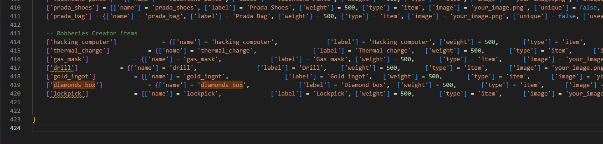

# Installation

The installation of the script is extremely easy

## Steps

1. Download the script and extract it in your resources
2. Add the script in your auto start (example: server.cfg)
3. The script will **automatically** setup the database, in case it doesn't, you can manually run the files in `robberies_creator/sql/` folder
4. Download and start the [cracking safe script](https://github.com/VHall1/pd-safe) _(Credits to_ [_VHall1_](https://github.com/VHall1)_)_
5. Download and start the [lockpicking script](https://github.com/baguscodestudio/lockpick) _(Credits to_ [_baguscodestudio_](https://github.com/baguscodestudio/lockpick)_)_

You are ready to go! Enjoy the script 😁

## Optional step

After the database is setup correctly, you can delete the files in `robberies_creator/sql/` folder, so the script won't try to setup the database each time you start the script

## Adding the items - Optional

### ESX

To add the premade items, you only have to run the file `robberies_creator/sql/items_limit.sql` **or** `robberies_creator/sql/items_weight.sql` depending on your server, if it uses the limit or the weight

### QBCore

To add the new items, you have to edit `qb-core/shared/items.lua` file and add at the bottom of the table the following code

```lua
-- Robberies Creator items
	['hacking_computer'] 			 = {['name'] = 'hacking_computer', 				['label'] = 'Hacking computer',	['weight'] = 500, 		['type'] = 'item', 		['image'] = 'your_image.png', 		['unique'] = false,		['useable'] = true, 	['shouldClose'] = true,	   ['combinable'] = nil,   ['description'] = 'Computer to hack panels'},
	['thermal_charge'] 			 = {['name'] = 'thermal_charge', 				['label'] = 'Thermal charge',	['weight'] = 500, 		['type'] = 'item', 		['image'] = 'your_image.png', 		['unique'] = false,		['useable'] = true, 	['shouldClose'] = true,	   ['combinable'] = nil,   ['description'] = 'Use to melt some doors'},
	['gas_mask'] 			 = {['name'] = 'gas_mask', 				['label'] = 'Gas mask',	['weight'] = 500, 		['type'] = 'item', 		['image'] = 'your_image.png', 		['unique'] = false,		['useable'] = true, 	['shouldClose'] = true,	   ['combinable'] = nil,   ['description'] = 'Protects from lethal gas'},
	['drill'] 			 = {['name'] = 'drill', 				['label'] = 'Drill',	['weight'] = 500, 		['type'] = 'item', 		['image'] = 'your_image.png', 		['unique'] = false,		['useable'] = true, 	['shouldClose'] = true,	   ['combinable'] = nil,   ['description'] = 'Can be used to open trucks doors'},
	['gold_ingot'] 			 = {['name'] = 'gold_ingot', 				['label'] = 'Gold ingot',	['weight'] = 500, 		['type'] = 'item', 		['image'] = 'your_image.png', 		['unique'] = false,		['useable'] = true, 	['shouldClose'] = true,	   ['combinable'] = nil,   ['description'] = 'Goooold'},
	['diamonds_box'] 			 = {['name'] = 'diamonds_box', 				['label'] = 'Diamond box',	['weight'] = 500, 		['type'] = 'item', 		['image'] = 'your_image.png', 		['unique'] = false,		['useable'] = true, 	['shouldClose'] = true,	   ['combinable'] = nil,   ['description'] = 'Diamooonds'},
	['lockpick'] 			 = {['name'] = 'lockpick', 				['label'] = 'Lockpick',	['weight'] = 500, 		['type'] = 'item', 		['image'] = 'your_image.png', 		['unique'] = false,		['useable'] = true, 	['shouldClose'] = true,	   ['combinable'] = nil,   ['description'] = 'Used to lockpick doors'},
```

#### Screenshot example

<figure><figcaption></figcaption></figure>
