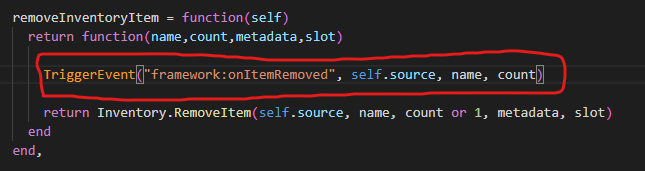

# Optimization

This page will show you how to optimize the script, following all the instructions will improve the script performance

## Item check

Use these **server-side** events right after any item addition/removal, they can be used anywhere (if you replace the parameters with the proper ones)

```lua
TriggerEvent("framework:onItemAdded", playerId, itemName, itemCount)
```

```lua
TriggerEvent("framework:onItemRemoved", playerId, itemName, itemCount)
```

### Examples

Note: if you use something that is not listed in the examples, editing it is down to you, the events listed above works anywhere if used properly

#### ESX

**Note: default ESX already has `esx:onAddInventoryItem` and `esx:onRemoveInventoryItem` which will allow you to not add anything, so follow the example only if you don't have those events for any reason**

Go in `es_extended/server/classes/player.lua` and add the following codes

<figure><figcaption></figcaption></figure>

<figure><figcaption></figcaption></figure>

#### OX Inventory (ESX)

Go in `es_extended/server/classes/overrides/oxinventory.lua` and add the following codes

<figure><figcaption></figcaption></figure>

<figure><figcaption></figcaption></figure>

#### QBCore (latest version)

Go in `qb-inventory/server/main.lua` and add the following codes

<figure><figcaption></figcaption></figure>

<figure><figcaption></figcaption></figure>

##
