# Fix hotwiring bought car

## Generic script

If after you purchase a vehicle you have to hotwire it, you only have to add [this simple line of code ](client/refresh-self-owned-vehicles.md)in your script code, after you know that the vehicle is added in `owned_vehicles` / `player_vehicles` table (depending on the framework)

You may want to add a `Citizen.Wait(2000)` before that line in case the vehicle wasn't yet in the table in the moment you triggered the event

## esx\_vehicleshop

### First step

Go to `esx_vehicleshop/server/main.lua` and search for the following code:

<figure>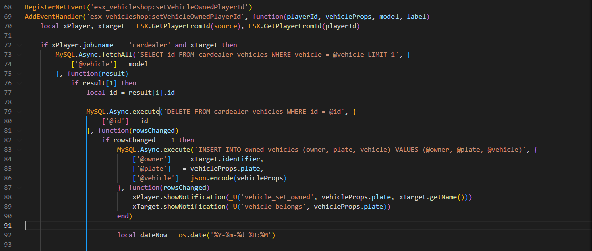<figcaption></figcaption></figure>

And add this line

```lua
exports["vehicles_keys"]:refreshPlayerOwnedVehicles(playerId)
```

<figure>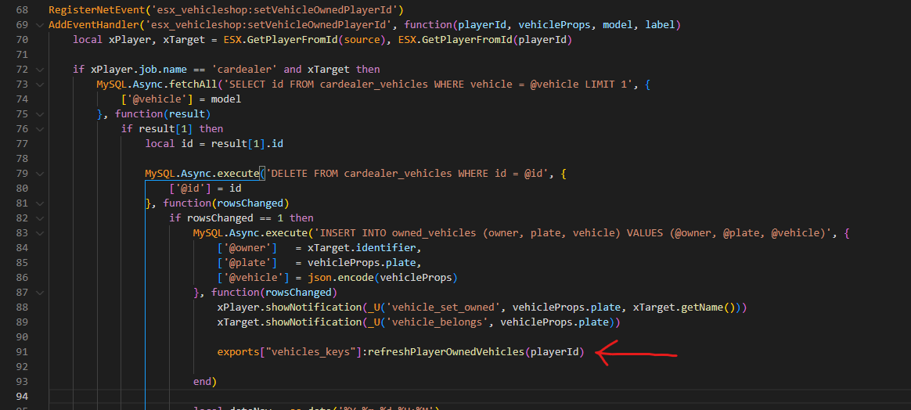<figcaption></figcaption></figure>

### Second step

Go to `esx_vehicleshop/server/main.lua` (the same file as before) and search for the following code:

<figure>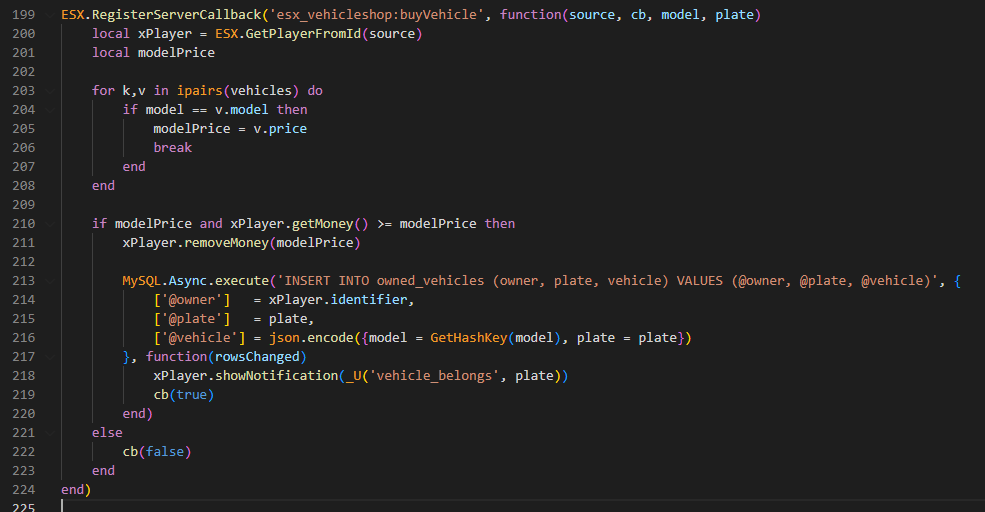<figcaption></figcaption></figure>

And add this line

```lua
exports["vehicles_keys"]:refreshPlayerOwnedVehicles(source)
```

<figure>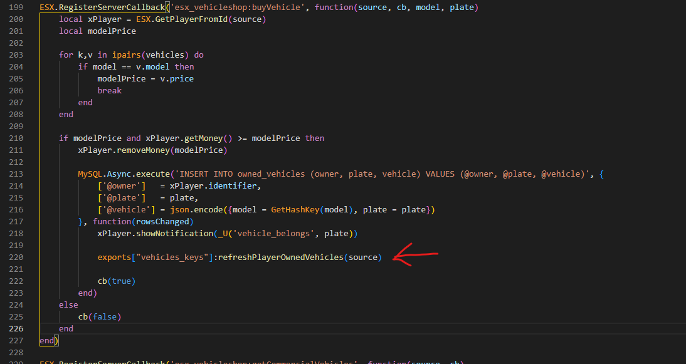<figcaption></figcaption></figure>

## esx\_advancedvehicleshop

Go to `esx_advancedvehicleshop/server/main.lua` and search for the following code:

<figure>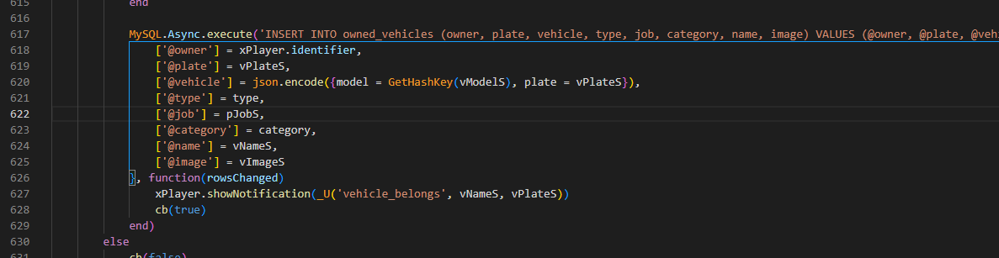<figcaption></figcaption></figure>

And add this line

```lua
exports["vehicles_keys"]:refreshPlayerOwnedVehicles(source)
```

<figure>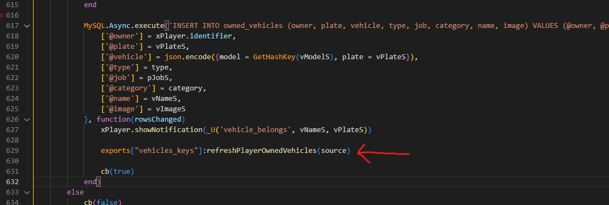<figcaption></figcaption></figure>

## qb-vehicleshop

### First step

Go to `qb-vehicleshop/server.lua` and you will have to add the following code after **all** `exports.oxmysql:insert`

In the example, it will be shown only one time, but you have to add it multiple times

<figure>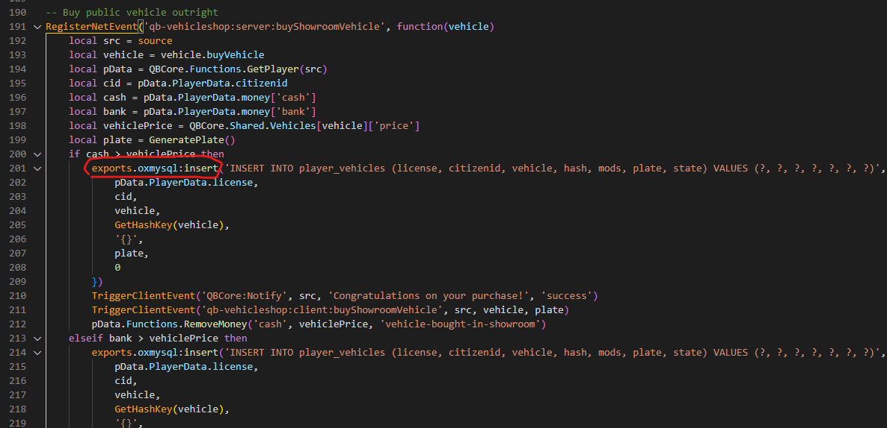<figcaption></figcaption></figure>

And add the following code

```lua
SetTimeout(1000, function() 
    exports["vehicles_keys"]:refreshPlayerOwnedVehicles( pData.PlayerData.source )
end)
```

In certain parts, you will have to replace `pData` with something else, here it will show where to add the code and on what `pData` depends

<figure>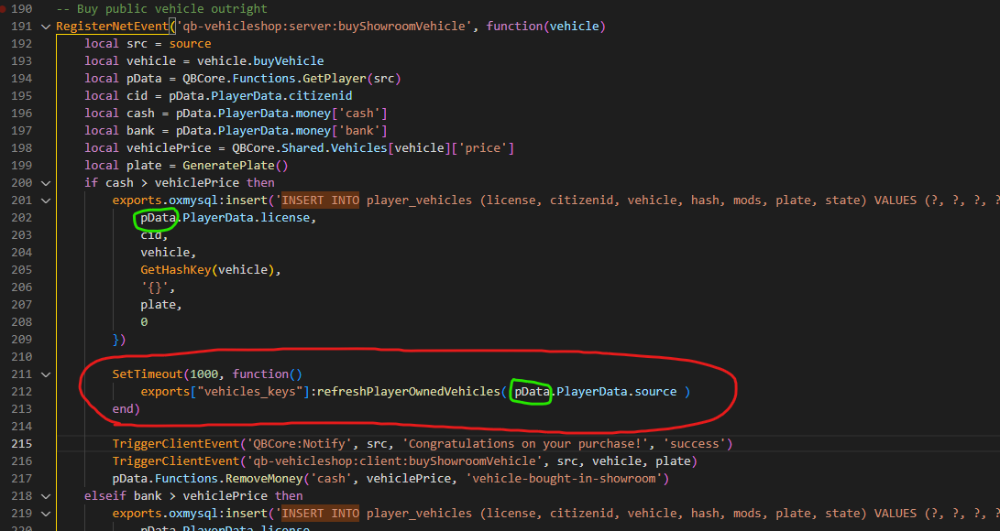<figcaption></figcaption></figure>

**Note**: the green circles showed in the screenshot must match, so if the first one is for example `targetPlayer`, the second one must be `targetPlayer` as well

### Second step

Go to `qb-vehicleshop/server.lua` (the same file as before) and replace all these events (they are at the bottom of the file)

```lua
TriggerClientEvent('vehiclekeys:client:SetOwner', buyerId, plate)
```

with the following code

```lua
exports["vehicles_keys"]:refreshPlayerOwnedVehicles(buyerId)
```

## okokVehicleShop

Go to `okokVehicleShop/sv_utils.lua` and search for the following code:

<figure>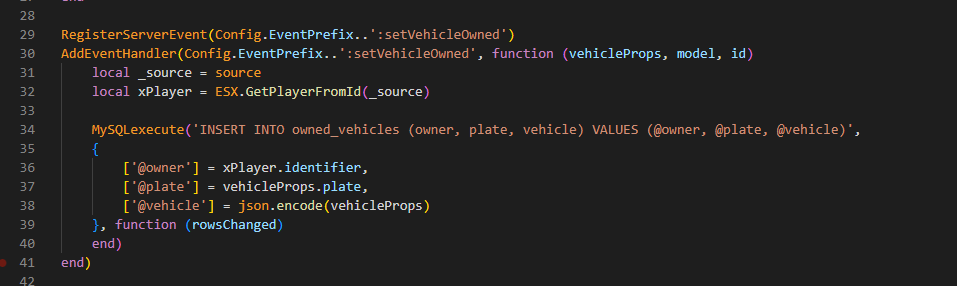<figcaption></figcaption></figure>

And add this line

```lua
exports["vehicles_keys"]:refreshPlayerOwnedVehicles(_source)
```

<figure>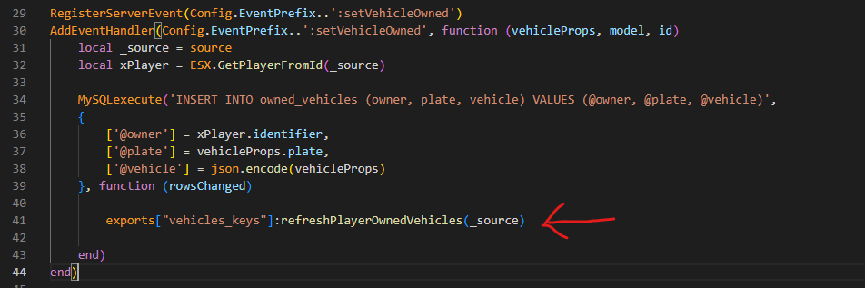<figcaption></figcaption></figure>

## s4-vehicleshop

Go to `s4-vehicleshop/server.lua` and search for the following code:

<figure><figcaption></figcaption></figure>

And add the following code:

```lua
SetTimeout(1000, function() 
    exports["vehicles_keys"]:refreshPlayerOwnedVehicles(src)
end)
```

<figure>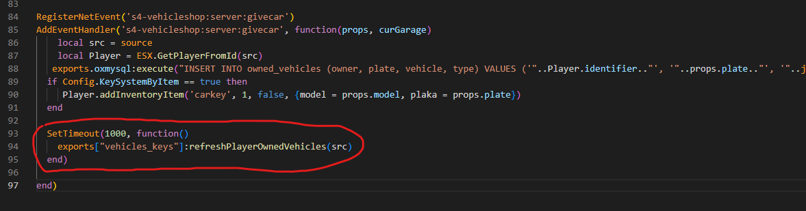<figcaption></figcaption></figure>

**Note:** this code will work for both _oxmysql_ and _ghmattimysql_ versions

## t1ger\_dealerships

### First step

Go to `t1ger_dealerships/server/main.lua` and add the following line below **all codes** (more than one) like as shown in the example

```lua
exports['t1ger_keys']:UpdateKeysToDatabase(props.plate, true)
```

<figure>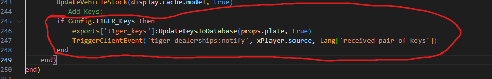<figcaption></figcaption></figure>

And add the following line

```lua
exports["vehicles_keys"]:refreshPlayerOwnedVehicles(xPlayer.source)
```

<figure>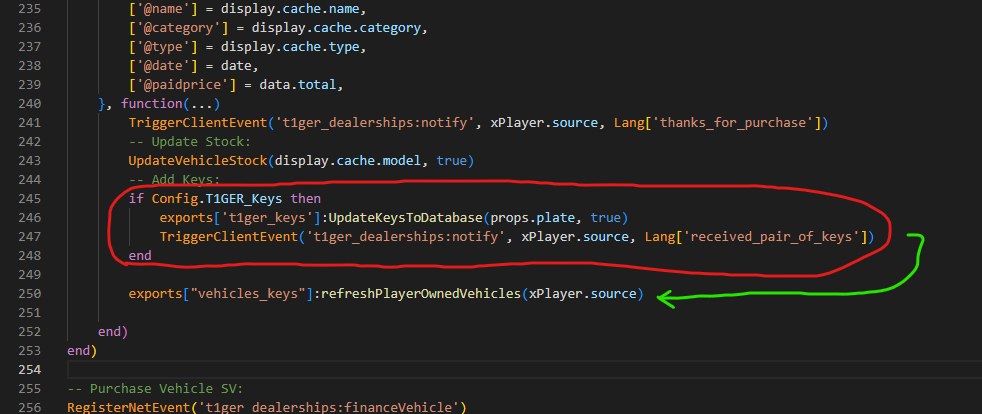<figcaption></figcaption></figure>

### Second step

Go to `t1ger_dealerships/server/main.lua` (same file as before) and search for the following code:

<figure>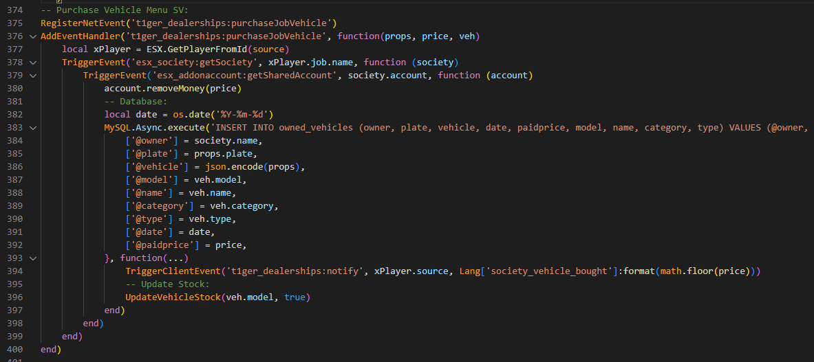<figcaption></figcaption></figure>

And add the following line

```lua
exports["vehicles_keys"]:refreshPlayerOwnedVehicles(xPlayer.source)
```

<figure>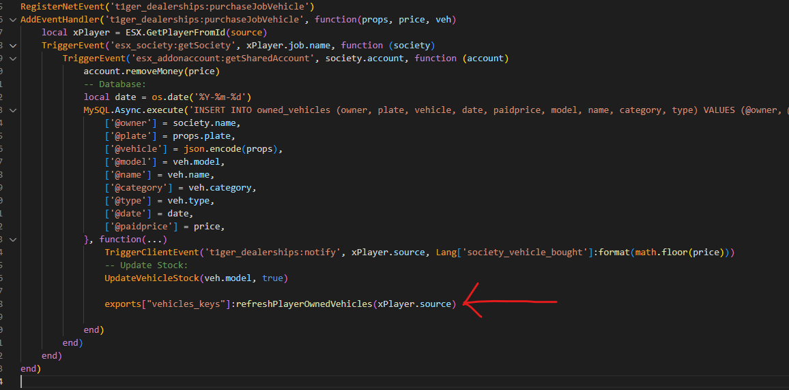<figcaption></figcaption></figure>
