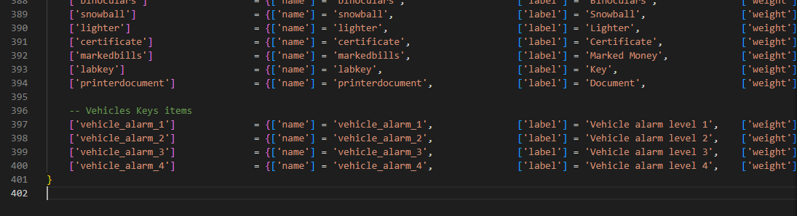

# Installation

The installation of the script is extremely easy


Do NOT use **FileZilla** to upload the files, otherwise the script will NOT work

Use [WinSCP](https://winscp.net/eng/download.php) instead




1. Download the script and extract it in your resources
2. Add the script in your auto start (example: server.cfg)
3. The script will **automatically** setup the database, in case it doesn't, you can manually run the files in `vehicles_keys/sql/` folder
4. Download and start the [lockpicking script](https://github.com/baguscodestudio/lockpick) _(Credits to_ [_baguscodestudio_](https://github.com/baguscodestudio/lockpick)_)_

## Adding the items - Optional

To add the premade items, you only have to run the file `vehicles_keys/sql/items_limit.sql` **or** `vehicles_keys/sql/items_weight.sql` depending on your server, if it uses the limit or the weight


The latest version of ESX uses **weight**



If it doesn't work, be sure to use the latest version of the official ESX with the dependencies




1. Download the script and extract it in your resources
2. Add the script in your auto start (example: server.cfg)
3. The script will **automatically** setup the database, in case it doesn't, you can manually run the files in `vehicles_keys/sql/` folder
4. Download and start the [lockpicking script](https://github.com/baguscodestudio/lockpick) _(Credits to_ [_baguscodestudio_](https://github.com/baguscodestudio/lockpick)_)_
5. Download and extract the [script menu\_default (clickable link) ](https://filebin.net/a3bxtl15me8pmm6l/menu\_default.rar)in your resources, **without renaming it**, and add it to auto start (example: server.cfg)

## Adding the items - Optional

To add the new items, you have to edit `qb-core/shared/items.lua` file and add at the bottom of the table the following code

```
	-- Vehicles Keys items
	['vehicle_alarm_1'] 			 = {['name'] = 'vehicle_alarm_1', 				['label'] = 'Vehicle alarm level 1',	['weight'] = 500, 		['type'] = 'item', 		['image'] = 'your_image.png',		['unique'] = false,		['useable'] = true, 	['shouldClose'] = true,	   ['combinable'] = nil,   ['description'] = 'Vehicle alarm level 1'},
	['vehicle_alarm_2'] 			 = {['name'] = 'vehicle_alarm_2', 				['label'] = 'Vehicle alarm level 2',	['weight'] = 500, 		['type'] = 'item', 		['image'] = 'your_image.png', 		['unique'] = false,		['useable'] = true, 	['shouldClose'] = true,	   ['combinable'] = nil,   ['description'] = 'Vehicle alarm level 2'},
	['vehicle_alarm_3'] 			 = {['name'] = 'vehicle_alarm_3', 				['label'] = 'Vehicle alarm level 3',	['weight'] = 500, 		['type'] = 'item', 		['image'] = 'your_image.png', 		['unique'] = false,		['useable'] = true, 	['shouldClose'] = true,	   ['combinable'] = nil,   ['description'] = 'Vehicle alarm level 3'},
	['vehicle_alarm_4'] 			 = {['name'] = 'vehicle_alarm_4', 				['label'] = 'Vehicle alarm level 4',	['weight'] = 500, 		['type'] = 'item', 		['image'] = 'your_image.png', 		['unique'] = false,		['useable'] = true, 	['shouldClose'] = true,	   ['combinable'] = nil,   ['description'] = 'Vehicle alarm level 4'},
	['vehicle_transfer_contract'] 		 = {['name'] = 'vehicle_transfer_contract', 			['label'] = 'Vehicle transfer contract',['weight'] = 500, 		['type'] = 'item', 		['image'] = 'your_image.png', 		['unique'] = false,		['useable'] = true, 	['shouldClose'] = true,	   ['combinable'] = nil,   ['description'] = 'Used to sell your vehicle to someone'},
```

<figure><figcaption><p>Example screenshot</p></figcaption></figure>



You are ready to go! Enjoy the script 😁

## Optional step

After the database is setup correctly, you can delete the files in `vehicles_keys/sql/` folder, so the script won't try to setup the database each time you start the script
